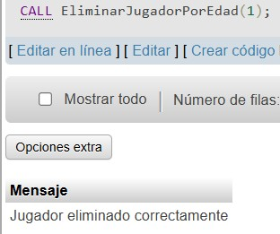
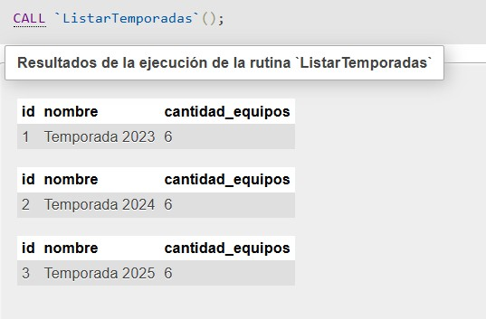

# Documentación Base de Datos
## Universo del Discurso:

La Federación de Voleibol organiza competiciones que se desarrollan en múltiples temporadas. Cada temporada involucra equipos de voleibol que se enfrentan en partidos, supervisados por árbitros. Los partidos siguen las reglas oficiales del deporte y se juegan al mejor de cinco sets. El sistema debe gestionar los detalles de los equipos, jugadores, árbitros, partidos y sets, así como mantener un registro de los resultados y las clasificaciones.

Cada **temporada** se refiere a un periodo de competición que puede tener lugar una o varias veces al año. Una temporada incluye múltiples partidos y su estructura puede variar (liguilla, eliminatorias, etc.). En esta parte del reto solo habrá una temporada, por lo que no hace falta reflejar en la base de datos. 
De cada temporada se desea almacenar la siguiente información Nombre, Cantidad Equipos, Cantidad Jornadas, Iniciado, Finalizado.

Las **jornadas** guardarán los enfrentamientos semanales de los equipos inscritos en la Temporada de ida y vuelta y no se podrán repetir, y se crearán de manera automática y proporcional a la cantidad de equipos. De cada jornada se desea almacenar la siguiente información: Id_jornada, Jugado.

Cada **equipo** es un grupo organizado de jugadores que participan en los partidos de la competición. Los equipos pueden representar a clubes, instituciones o ciudades. De cada equipo se desea almacenar la siguiente información: número Identificativo,Id Equipo, Nombre del equipo, Entrenador, Fecha de Fundación, Partidos Ganados, Partidos Perdidos, Puntaje Total Acumulado.

Los **jugadores** son los miembros de los equipos. Cada jugador tiene una posición y un rol dentro del equipo y participa en los partidos según las reglas del voleibol. De cada jugador se desea almacenar la siguiente información: ID jugador, Nombre completo, Fecha de Nacimiento, Nro camiseta, Posición, Altura, Peso. Los jugadores pueden ser fichados y/o trasladados a un club siempre que no se haya empezado la temporada.
Un partido de voleibol enfrenta a dos equipos y se compone de varios sets. El equipo que gane más sets se proclamará vencedor del partido. De cada partido se desea almacenar la siguiente información: ID Partido, Equipo local, Equipo visitante, Resultado Final, Estado del partido, Puntaje_EquiLocal, Puntaje_EquiVisitante.

Cada **partido** contiene 5 sets. Un set se gana cuando un equipo alcanza 25 puntos con una ventaja de 2 puntos sobre el rival. Si el partido llega a un quinto set, este se juega a 15 puntos e igualmente sobre una ventaja de 2 puntos ante el rival.

El ganador de un partido es el primer equipo que sume 3 sets ganados. El marcador final se registra como parte de **Puntos Totales** de la temporada e influye en la clasificación general de los equipos cuando existen 2 equipos en empate de **Partidos Ganados**. De haber nuevamente un empate en relación a **Puntos Totales**, se decidirá el desempate por el año de fundación de cada equipo.

El sistema debe calcular y mantener una clasificación de los equipos basada en los resultados de los partidos de manera actualizada según avancen las Jornadas. Los equipos reciben puntos por cada partido ganado y se mantienen registros de sus estadísticas a lo largo de la temporada.


**Cambios realizados en el Universo del Discurso:**


## Diagrama entidad relacion actualizado


## Gestion de usuarios

### Creación, borrado y modificación de usuarios,concesión y retirada de privilegios, roles, perfiles, sinónimos

-- Código del Procedimiento:
```sql
-- Crear roles
CREATE ROLE IF NOT EXISTS 'director';
CREATE ROLE IF NOT EXISTS 'gestor';
CREATE ROLE IF NOT EXISTS 'arbitro';
CREATE ROLE IF NOT EXISTS 'usuario';

-- Crear usuarios y asignar roles
CREATE USER IF NOT EXISTS 'director'@'localhost' IDENTIFIED BY '1234';
GRANT 'director' TO 'director'@'localhost';

CREATE USER IF NOT EXISTS 'gestor'@'localhost' IDENTIFIED BY '1234';
GRANT 'gestor' TO 'gestor'@'localhost';

CREATE USER IF NOT EXISTS 'arbitro'@'localhost' IDENTIFIED BY '1234';
GRANT 'arbitro' TO 'arbitro'@'localhost';

CREATE USER IF NOT EXISTS 'usuario'@'localhost' IDENTIFIED BY '1234';
GRANT 'usuario' TO 'usuario'@'localhost';

-- Asignar permisos
GRANT ALL PRIVILEGES ON reto3.* TO 'director';

GRANT SELECT, INSERT, UPDATE, DELETE ON reto3.* TO 'gestor';

GRANT SELECT ON reto3.* TO 'arbitro';
GRANT INSERT, UPDATE ON reto3.jornadas TO 'arbitro';

GRANT SELECT ON reto3.jornadas TO 'usuario';

-- Aplicar cambios
FLUSH PRIVILEGES;

```

__-- Llamadas para probar los procedimientos__


## Procedimientos


### Procedimientos con estructuras de control alternativa simple o doble

#### -- Procedimiento 1: Insertar un nuevo equipo en la base de datos.
Siempre que no exista ya un equipo con el mismo nombre.Si el equipo no existe, se insertan valores predeterminados para el número de victorias, derrotas, puntos totales y total de partidos.

-- Código del Procedimiento:

```sql
DELIMITER //

CREATE PROCEDURE InsertarEquipo(IN nombre VARCHAR(255), IN entrenador VARCHAR(255), IN fundacion DATE)
BEGIN
    DECLARE equipoExiste INT;
    
    -- Verificar si el equipo ya existe
    SELECT COUNT(*) INTO equipoExiste FROM Equipos WHERE Equ_nombre = nombre;
    
    IF equipoExiste = 0 THEN
        -- Insertar el nuevo equipo
        INSERT INTO Equipos (Equ_nombre, Equ_entrenador, Equ_fundacion, Equ_victorias, Equ_derrotas, Equ_puntos_totales, Equ_total_partidos)
        VALUES (nombre, entrenador, fundacion, 0, 0, 0, 0);
        
        SELECT 'Equipo insertado correctamente' AS Mensaje;
    ELSE
        SELECT 'El equipo ya existe' AS Mensaje;
    END IF;
END //

DELIMITER ;
```

__-- Llamadas para probar los procedimientos__


#### -- Procedimiento 2: Modificar las victorias de un equipo si existe

-- Código del Procedimiento:

```sql
DELIMITER //
CREATE PROCEDURE ModificarVictorias(IN nombre VARCHAR(255), IN victorias INT)
BEGIN
    DECLARE equipoExiste INT;
    
    -- Verificar si el equipo existe
    SELECT COUNT(*) INTO equipoExiste FROM Equipos WHERE Equ_nombre = nombre;
    
    IF equipoExiste > 0 THEN
        -- Actualizar las victorias del equipo
        UPDATE Equipos SET Equ_victorias = victorias WHERE Equ_nombre = nombre;
        
        SELECT 'Victorias actualizadas correctamente' AS Mensaje;
    ELSE
        SELECT 'El equipo no existe' AS Mensaje;
    END IF;
END //

DELIMITER ;
```

__-- Llamadas para probar los procedimientos__


### Creación de procedimientos con la estructura de control alternativa múltiple

#### -- Procedimiento 3: Actualizar estado de la temporada
Este procedimiento actualiza el estado de una temporada según su ID.

-- Código del Procedimiento:

```sql
DELIMITER //
CREATE PROCEDURE ActualizarEstadoTemporada(IN temporadaID INT, IN nuevoEstado VARCHAR(20))
BEGIN
    DECLARE estadoActual BOOLEAN;
    
    -- Obtener el estado actual de la temporada
    SELECT Tem_iniciado INTO estadoActual FROM Temporadas WHERE Tem_id = temporadaID;
    
    CASE
        WHEN estadoActual IS NULL THEN
            SELECT 'La temporada no existe' AS Mensaje;
        WHEN nuevoEstado = 'iniciar' AND estadoActual = FALSE THEN
            UPDATE Temporadas SET Tem_iniciado = TRUE WHERE Tem_id = temporadaID;
            SELECT 'Temporada iniciada correctamente' AS Mensaje;
        WHEN nuevoEstado = 'finalizar' AND estadoActual = TRUE THEN
            UPDATE Temporadas SET Tem_finalizado = TRUE WHERE Tem_id = temporadaID;
            SELECT 'Temporada finalizada correctamente' AS Mensaje;
        ELSE
            SELECT 'No se puede realizar la acción solicitada' AS Mensaje;
    END CASE;
END //
DELIMITER ;
```

__-- Llamadas para probar los procedimientos__


### Creación de procedimientos con la estructura de control CASE de comprobación
 
#### -- Procedimiento 4: Cambiar el estado de un equipo (activo/inactivo)

-- Código del Procedimiento:

 ```sql
DELIMITER //
CREATE PROCEDURE CambiarEstadoEquipo(IN nombre VARCHAR(255), IN nuevoEstado VARCHAR(10))
BEGIN
    DECLARE equipoExiste INT;
    DECLARE estadoActual VARCHAR(10);

    -- Verificar si el equipo existe
    SELECT COUNT(*), CASE WHEN Equ_victorias >= 10 THEN 'activo' ELSE 'inactivo' END 
    INTO equipoExiste, estadoActual FROM Equipos WHERE Equ_nombre = nombre;

    IF equipoExiste = 0 THEN
        SELECT 'El equipo no existe' AS Mensaje;
    ELSE
        CASE 
            WHEN nuevoEstado = 'activo' AND estadoActual = 'inactivo' THEN
                UPDATE Equipos SET Equ_victorias = 10 WHERE Equ_nombre = nombre;
                SELECT 'El equipo ha sido activado' AS Mensaje;
            WHEN nuevoEstado = 'inactivo' AND estadoActual = 'activo' THEN
                UPDATE Equipos SET Equ_victorias = 0 WHERE Equ_nombre = nombre;
                SELECT 'El equipo ha sido desactivado' AS Mensaje;
            ELSE
                SELECT 'El equipo ya está en el estado solicitado' AS Mensaje;
        END CASE;
    END IF;
END //
DELIMITER ;
```

__-- Llamadas para probar los procedimientos__


#### -- Procedimiento 5: Eliminar un jugador según su edad

-- Código del Procedimiento:

```sql
DELIMITER //
CREATE PROCEDURE EliminarJugadorPorEdad(IN jugadorID INT)
BEGIN
    DECLARE edadJugador INT;

    -- Obtener la edad del jugador
    SELECT TIMESTAMPDIFF(YEAR, Jug_nacimiento, CURDATE()) INTO edadJugador FROM Jugadores WHERE Jug_id = jugadorID;

    CASE 
        WHEN edadJugador IS NULL THEN
            SELECT 'El jugador no existe' AS Mensaje;
        WHEN edadJugador < 18 THEN
            SELECT 'No se puede eliminar, el jugador es menor de edad' AS Mensaje;
        ELSE
            DELETE FROM Jugadores WHERE Jug_id = jugadorID;
            SELECT 'Jugador eliminado correctamente' AS Mensaje;
    END CASE;
END //
DELIMITER ;
```

__-- Llamadas para probar los procedimientos__



### Procedimientos  con manejo de excepciones


#### -- Procedimiento 6: Inserción de un nuevo jugador

-- Código del Procedimiento:

```sql
DELIMITER //
CREATE PROCEDURE insertar_jugador(
    IN p_Jug_id INT,
    IN p_Jug_nombre_completo VARCHAR(255),
    IN p_Jug_fecha_nacimiento DATE,
    IN p_Jug_nacionalidad VARCHAR(255),
    IN p_Jug_dorsal SMALLINT UNSIGNED,
    IN p_Jug_posicion VARCHAR(255),
    IN p_Jug_IDEquipo INT
)
BEGIN
    DECLARE EXIT HANDLER FOR SQLEXCEPTION
    BEGIN
        ROLLBACK;
        SELECT 'Error al insertar el jugador';
    END;
    START TRANSACTION;
    INSERT INTO Jugadores (Jug_id, Jug_nombre_completo, Jug_fecha_nacimiento, Jug_nacionalidad, Jug_dorsal, Jug_posicion, Jug_IDEquipo)
    VALUES (p_Jug_id, p_Jug_nombre_completo, p_Jug_fecha_nacimiento, p_Jug_nacionalidad, p_Jug_dorsal, p_Jug_posicion, p_Jug_IDEquipo);
    COMMIT;
    SELECT 'Jugador insertado correctamente';
END //
DELIMITER ;
```

__-- Llamadas para probar los procedimientos__


#### -- Procedimiento 7: Borrado de un jugador

-- Código del Procedimiento:

```sql
DELIMITER //
CREATE PROCEDURE borrar_jugador(IN p_Jug_id INT)
BEGIN
    DECLARE EXIT HANDLER FOR SQLEXCEPTION
    BEGIN
        ROLLBACK;
        SELECT 'Error al borrar el jugador';
    END;
    START TRANSACTION;
    DELETE FROM Jugadores WHERE Jug_id = p_Jug_id;
    COMMIT;
    SELECT 'Jugador borrado correctamente';
END //
DELIMITER ;
```

__-- Llamadas para probar los procedimientos__


#### -- Procedimiento 8: Modificación del nombre de un equipo

-- Código del Procedimiento:

```sql
DELIMITER //
CREATE PROCEDURE modificar_nombre_equipo(
    IN p_Equ_id INT,
    IN p_NuevoNombre VARCHAR(255)
)
BEGIN
    DECLARE EXIT HANDLER FOR SQLEXCEPTION
    BEGIN
        ROLLBACK;
        SELECT 'Error al modificar el nombre del equipo';
    END;
    START TRANSACTION;
    UPDATE Equipos SET Equ_nombre = p_NuevoNombre WHERE Equ_id = p_Equ_id;
    COMMIT;
    SELECT 'Nombre del equipo modificado correctamente';
END //
DELIMITER ;
```

__-- Llamadas para probar los procedimientos__


#### -- Procedimiento 9: Inserción de un nuevo partido

-- Código del Procedimiento:

```sql
DELIMITER //
CREATE PROCEDURE insertar_partido(
    IN p_Par_id INT,
    IN p_Par_goles_loc SMALLINT UNSIGNED,
    IN p_Par_puntos_loc SMALLINT UNSIGNED,
    IN p_Par_goles_vis SMALLINT UNSIGNED,
    IN p_Par_puntos_vis SMALLINT UNSIGNED,
    IN p_Par_equipo_loc INT,
    IN p_Par_equipo_vis INT,
    IN p_Par_Arbitro_1 VARCHAR(10),
    IN p_Par_Arbitro_2 VARCHAR(10),
    IN p_Par_id_jornada INT
)
BEGIN
    DECLARE EXIT HANDLER FOR SQLEXCEPTION
    BEGIN
        ROLLBACK;
        SELECT 'Error al insertar el partido';
    END;
    DECLARE EXIT HANDLER FOR SQLWARNING
    BEGIN
        ROLLBACK;
        SELECT 'Advertencia al insertar el partido';
    END;
    START TRANSACTION;
    INSERT INTO Partidos (Par_id, Par_goles_loc, Par_puntos_loc, Par_goles_vis, Par_puntos_vis, Par_equipo_loc, Par_equipo_vis, Par_Arbitro_1, Par_Arbitro_2, Par_id_jornada)
    VALUES (p_Par_id, p_Par_goles_loc, p_Par_puntos_loc, p_Par_goles_vis, p_Par_puntos_vis, p_Par_equipo_loc, p_Par_equipo_vis, p_Par_Arbitro_1, p_Par_Arbitro_2, p_Par_id_jornada);
    COMMIT;
    SELECT 'Partido insertado correctamente';
END //
DELIMITER ;
```

__-- Llamadas para probar los procedimientos__


#### -- Procedimiento 10: Borrado de un equipo

-- Código del Procedimiento:

```sql
DELIMITER //
CREATE PROCEDURE borrar_equipo(IN p_Equ_id INT)
BEGIN
    DECLARE EXIT HANDLER FOR SQLEXCEPTION
    BEGIN
        ROLLBACK;
        SELECT 'Error al borrar el equipo';
    END;
    DECLARE EXIT HANDLER FOR SQLWARNING
    BEGIN
        ROLLBACK;
        SELECT 'Advertencia al borrar el equipo';
    END;
    START TRANSACTION;
    DELETE FROM Equipos WHERE Equ_id = p_Equ_id;
    COMMIT;
    SELECT 'Equipo borrado correctamente';
END //
DELIMITER ;
```

__-- Llamadas para probar los procedimientos__


#### -- Procedimiento 11: Modificación del DNI de un entrenador

-- Código del Procedimiento:

```sql
DELIMITER //
CREATE PROCEDURE modificar_dni_entrenador(
    IN p_Entrenador_id INT,
    IN p_NuevoDNI VARCHAR(10)
)
BEGIN
    DECLARE EXIT HANDLER FOR SQLEXCEPTION
    BEGIN
        ROLLBACK;
        SELECT 'Error al modificar el DNI del entrenador';
    END;
    START TRANSACTION;
    UPDATE Entrenadores SET DNI = p_NuevoDNI WHERE Entrenador_id = p_Entrenador_id;
    COMMIT;
    SELECT 'DNI del entrenador modificado correctamente';
END //
DELIMITER ;
```

__-- Llamadas para probar los procedimientos__


#### -- Procedimiento 12: Inserción de un nuevo árbitro

-- Código del Procedimiento:

```sql
DELIMITER //
CREATE PROCEDURE insertar_arbitro(
    IN p_Arb_id INT,
    IN p_Arb_nombre_completo VARCHAR(255),
    IN p_Arb_Nficha VARCHAR(10),
    IN p_Arb_fecha_nacimiento DATE,
    IN p_Arb_id_partido INT
)
BEGIN
    DECLARE EXIT HANDLER FOR SQLEXCEPTION
    BEGIN
        ROLLBACK;
        SELECT 'Error al insertar el árbitro';
    END;
    START TRANSACTION;
    INSERT INTO Arbitros (Arb_id, Arb_nombre_completo, Arb_Nficha, Arb_fecha_nacimiento, Arb_id_partido)
    VALUES (p_Arb_id, p_Arb_nombre_completo, p_Arb_Nficha, p_Arb_fecha_nacimiento, p_Arb_id_partido);
    COMMIT;
    SELECT 'Árbitro insertado correctamente';
END //
DELIMITER ;
```

__-- Llamadas para probar los procedimientos__


#### -- Procedimiento 13: Borrado de un árbitro

-- Código del Procedimiento:

```sql
DELIMITER //
CREATE PROCEDURE borrar_arbitro(IN p_Arb_id INT)
BEGIN
    DECLARE EXIT HANDLER FOR SQLEXCEPTION
    BEGIN
        ROLLBACK;
        SELECT 'Error al borrar el árbitro';
    END;
    START TRANSACTION;
    DELETE FROM Arbitros WHERE Arb_id = p_Arb_id;
    COMMIT;
    SELECT 'Árbitro borrado correctamente';
END //
DELIMITER ;
```

__-- Llamadas para probar los procedimientos__


#### -- Procedimiento 14: Modificación de la fecha de nacimiento de un jugador

-- Código del Procedimiento:

```sql
DELIMITER //
CREATE PROCEDURE modificar_fecha_nacimiento_jugador(
    IN p_Jug_id INT,
    IN p_NuevaFechaNacimiento DATE
)
BEGIN
    DECLARE EXIT HANDLER FOR SQLEXCEPTION
    BEGIN
        ROLLBACK;
        SELECT 'Error al modificar la fecha de nacimiento del jugador';
    END;
    START TRANSACTION;
    UPDATE Jugadores SET Jug_fecha_nacimiento = p_NuevaFechaNacimiento WHERE Jug_id = p_Jug_id;
    COMMIT;
    SELECT 'Fecha de nacimiento del jugador modificada correctamente';
END //
DELIMITER ;
```

__-- Llamadas para probar los procedimientos__


#### -- Procedimiento 15: Insercion de un nuevo entrenador

-- Código del Procedimiento:

```sql
DELIMITER //
CREATE PROCEDURE insertar_entrenador(
    IN p_Entrenador_id INT,
    IN p_Nombre VARCHAR(255),
    IN p_DNI VARCHAR(10),
    IN p_FechaNacimiento DATE,
    IN p_ID_Equipo INT
)
BEGIN
    DECLARE EXIT HANDLER FOR SQLEXCEPTION
    BEGIN
        ROLLBACK;
        SELECT 'Error al insertar el entrenador';
    END;
    START TRANSACTION;
    INSERT INTO Entrenadores (Entrenador_id, Nombre, DNI, FechaNacimiento, ID_Equipo)
    VALUES (p_Entrenador_id, p_Nombre, p_DNI, p_FechaNacimiento, p_ID_Equipo);
    COMMIT;
    SELECT 'Entrenador insertado correctamente';
END //
DELIMITER ;
```

__-- Llamadas para probar los procedimientos__


#### -- Procedimiento 16: Borrado de un entrenador

-- Código del Procedimiento:

```sql
DELIMITER //
CREATE PROCEDURE borrar_entrenador(IN p_Entrenador_id INT)
BEGIN
    DECLARE EXIT HANDLER FOR SQLEXCEPTION
    BEGIN
        ROLLBACK;
        SELECT 'Error al borrar el entrenador';
    END;
    START TRANSACTION;
    DELETE FROM Entrenadores WHERE Entrenador_id = p_Entrenador_id;
    COMMIT;
    SELECT 'Entrenador borrado correctamente';
END //
DELIMITER ;
```

__-- Llamadas para probar los procedimientos__


#### -- Procedimiento 17: Modificación del resultado de un partido

-- Código del Procedimiento:

```sql
DELIMITER //
CREATE PROCEDURE modificar_resultado_partido(
    IN p_Par_id INT,
    IN p_Par_goles_loc SMALLINT UNSIGNED,
    IN p_Par_puntos_loc SMALLINT UNSIGNED,
    IN p_Par_goles_vis SMALLINT UNSIGNED,
    IN p_Par_puntos_vis SMALLINT UNSIGNED
)
BEGIN
    DECLARE EXIT HANDLER FOR SQLEXCEPTION
    BEGIN
        ROLLBACK;
        SELECT 'Error al modificar el resultado del partido';
    END;
    START TRANSACTION;
    UPDATE Partidos 
    SET Par_goles_loc = p_Par_goles_loc, 
        Par_puntos_loc = p_Par_puntos_loc, 
        Par_goles_vis = p_Par_goles_vis, 
        Par_puntos_vis = p_Par_puntos_vis 
    WHERE Par_id = p_Par_id;
    COMMIT;
    SELECT 'Resultado del partido modificado correctamente';
END //
DELIMITER ;
```

__-- Llamadas para probar los procedimientos__


### Creación de procedimientos con cursores
    
#### -- Procedimiento 15: listar equipos

-- Código del Procedimiento:

```sql
DELIMITER //
CREATE PROCEDURE ListarEquipos()
BEGIN
    DECLARE done INT DEFAULT 0;
    DECLARE id INT;
    DECLARE nombre VARCHAR(255);
    DECLARE victorias INT;
    DECLARE derrotas INT;
    DECLARE total_puntos INT;
    
    DECLARE equipo_cursor CURSOR FOR
    SELECT Equ_id, Equ_nombre, Equ_victorias, Equ_derrotas, Equ_puntos_totales FROM Equipos;
    
    DECLARE CONTINUE HANDLER FOR NOT FOUND SET done = 1;
    
    OPEN equipo_cursor;
    read_loop: LOOP
        FETCH equipo_cursor INTO id, nombre, victorias, derrotas, total_puntos;
        IF done THEN
            LEAVE read_loop;
        END IF;
        
        SELECT id, nombre, victorias, derrotas, total_puntos;
    END LOOP;
    
    CLOSE equipo_cursor;
END //
DELIMITER ;
```

__-- Llamadas para probar los procedimientos__


#### -- Procedimiento 16: listar temporadas

-- Código del Procedimiento:

```sql
DELIMITER //
CREATE PROCEDURE ListarTemporadas()
BEGIN
    DECLARE done INT DEFAULT 0;
    DECLARE id INT;
    DECLARE nombre VARCHAR(255);
    DECLARE cantidad_equipos INT;
    
    DECLARE temporada_cursor CURSOR FOR
    SELECT Tem_id, Tem_nombre, Tem_cantidad_equipos FROM Temporadas;
    
    DECLARE CONTINUE HANDLER FOR NOT FOUND SET done = 1;
    
    OPEN temporada_cursor;
    read_loop: LOOP
        FETCH temporada_cursor INTO id, nombre, cantidad_equipos;
        IF done THEN
            LEAVE read_loop;
        END IF;
        
        SELECT id, nombre, cantidad_equipos;
    END LOOP;
    
    CLOSE temporada_cursor;
END //
DELIMITER ;
```

__-- Llamadas para probar los procedimientos__



#### -- Procedimiento 17: Modificacion del resultado de un partido

-- Código del Procedimiento:

```sql
DELIMITER //
CREATE PROCEDURE ListarTemporadas()
BEGIN
    DECLARE done INT DEFAULT 0;
    DECLARE id INT;
    DECLARE nombre VARCHAR(255);
    DECLARE cantidad_equipos INT;
    
    DECLARE temporada_cursor CURSOR FOR
    SELECT Tem_id, Tem_nombre, Tem_cantidad_equipos FROM Temporadas;
    
    DECLARE CONTINUE HANDLER FOR NOT FOUND SET done = 1;
    
    OPEN temporada_cursor;
    read_loop: LOOP
        FETCH temporada_cursor INTO id, nombre, cantidad_equipos;
        IF done THEN
            LEAVE read_loop;
        END IF;
        
        SELECT id, nombre, cantidad_equipos;
    END LOOP;
    
    CLOSE temporada_cursor;
END //
DELIMITER ;

-- Procedimiento 3: Consulta compleja con JOIN - Mostrar los máximos goleadores de cada equipo
DELIMITER //
CREATE PROCEDURE MaximosGoleadores()
BEGIN
    DECLARE done INT DEFAULT 0;
    DECLARE equipo_nombre VARCHAR(255);
    DECLARE jugador_nombre VARCHAR(255);
    DECLARE goles INT;
    
    DECLARE cursor_goleadores CURSOR FOR
    SELECT e.Equ_nombre, j.Jug_nombre_completo, j.Jug_dorsal FROM Jugadores j
    JOIN Equipos e ON j.Jug_id_equipo = e.Equ_id
    WHERE j.Jug_dorsal = (SELECT MAX(Jug_dorsal) FROM Jugadores WHERE Jug_id_equipo = e.Equ_id);
    
    DECLARE CONTINUE HANDLER FOR NOT FOUND SET done = 1;
    
    OPEN cursor_goleadores;
    read_loop: LOOP
        FETCH cursor_goleadores INTO equipo_nombre, jugador_nombre, goles;
        IF done THEN
            LEAVE read_loop;
        END IF;
        
        SELECT equipo_nombre, jugador_nombre, goles;
    END LOOP;
    
    CLOSE cursor_goleadores;
END //
DELIMITER ;
```

__-- Llamadas para probar los procedimientos__


### Creación de funciones con diferentes estructuras de control, cursores y excepciones

#### -- Funcion 1: calcula el promedio de puntos por partido de un equipo específico.

-- Código de la Funcion:

```sql
DELIMITER //
CREATE FUNCTION PromedioPuntosPorPartido(equipo_id INT) 
RETURNS DECIMAL(10,2)
DETERMINISTIC
BEGIN
    DECLARE puntos_total SMALLINT UNSIGNED;
    DECLARE partidos_total SMALLINT UNSIGNED;
    DECLARE promedio DECIMAL(10,2) DEFAULT 0.00;
    
    -- Manejo de excepciones
    DECLARE CONTINUE HANDLER FOR NOT FOUND RETURN 0.00;
    DECLARE CONTINUE HANDLER FOR 1365 RETURN 0.00; 
    
    SELECT Equ_puntos_totales, Equ_total_partidos 
    INTO puntos_total, partidos_total
    FROM Equipos 
    WHERE Equ_id = equipo_id;
    
    IF partidos_total > 0 THEN
        SET promedio = puntos_total / partidos_total;
    END IF;
    
    RETURN promedio;
END //
DELIMITER ;
```

__-- Llamadas para probar los procedimientos__


#### -- Funcion 2: cuenta cuántos jugadores de un equipo ocupan una determinada posición.

-- Código de la Funcion:

```sql
DELIMITER //
CREATE FUNCTION ContarJugadoresPorPosicion(equipo_id INT, posicion VARCHAR(255)) 
RETURNS INT
DETERMINISTIC
BEGIN
    DECLARE contador INT DEFAULT 0;
    DECLARE done INT DEFAULT FALSE;
    DECLARE jugador_posicion VARCHAR(255);
    
    DECLARE cur CURSOR FOR 
        SELECT Jug_posicion 
        FROM Jugadores 
        WHERE Jug_id_equipo = equipo_id;
    
    DECLARE CONTINUE HANDLER FOR NOT FOUND SET done = TRUE;
    
    OPEN cur;
    
    bucle: LOOP
        FETCH cur INTO jugador_posicion;
        IF done THEN
            LEAVE bucle;
        END IF;
        
        IF jugador_posicion = posicion THEN
            SET contador = contador + 1;
        END IF;
    END LOOP;
    
    CLOSE cur;
    
    RETURN contador;
END //
DELIMITER ;
```

__-- Llamadas para probar los procedimientos__


#### -- Funcion 3: calcula la diferencia total de sets ganados y perdidos por un equipo en todos los partidos en los que ha participado.

-- Código de la Funcion:

```sql
DELIMITER //
CREATE FUNCTION DiferenciaSets(equipo_id INT) 
RETURNS INT
DETERMINISTIC
BEGIN
    DECLARE diferencia INT DEFAULT 0;
    DECLARE sets_loc SMALLINT;
    DECLARE sets_vis SMALLINT;
    DECLARE done INT DEFAULT FALSE;
    DECLARE equipo_es_local BOOLEAN;
    
    DECLARE cur CURSOR FOR 
        SELECT Par_sets_loc, Par_sets_vis, Par_equipo_loc = equipo_id
        FROM Partidos 
        WHERE Par_equipo_loc = equipo_id OR Par_equipo_vis = equipo_id;
    
    DECLARE CONTINUE HANDLER FOR NOT FOUND SET done = TRUE;
    
    OPEN cur;
    
    bucle: LOOP
        FETCH cur INTO sets_loc, sets_vis, equipo_es_local;
        IF done THEN
            LEAVE bucle;
        END IF;
        
        IF equipo_es_local THEN
            SET diferencia = diferencia + (sets_loc - sets_vis);
        ELSE
            SET diferencia = diferencia + (sets_vis - sets_loc);
        END IF;
    END LOOP;
    
    CLOSE cur;
    
    RETURN diferencia;
END //
DELIMITER ;
```

__-- Llamadas para probar los procedimientos__


## Creacion de vistas


__Vista para obtener un resumen de todas las temporadas__
```sql
CREATE VIEW Vista_Temporadas AS
SELECT Tem_id, Tem_nombre, Tem_cantidad_jornadas, Tem_cantidad_equipos, 
       CASE 
           WHEN Tem_finalizado = TRUE THEN 'Finalizada'
           WHEN Tem_iniciado = TRUE THEN 'En Curso'
           ELSE 'Pendiente'
       END AS Estado
FROM Temporadas;
```

__-- Llamadas para probar los procedimientos__


__Vista para obtener las jornadas con el estado y su temporada asociada__
```sql
CREATE VIEW Vista_Jornadas AS
SELECT J.Jor_id, J.Jor_jugado, T.Tem_nombre AS Temporada
FROM Jornadas J
JOIN Temporadas T ON J.Jor_id_temporada = T.Tem_id;
```
__-- Llamadas para probar los procedimientos__


__Vista para obtener los registros de cambios__
```sql
CREATE VIEW Vista_Logs AS
SELECT Log_id, Log_fecha, Log_accion, Log_detalle
FROM Logs
ORDER BY Log_fecha DESC;
```
__-- Llamadas para probar los procedimientos__


## Creacion de Triggers


__Crear tabla de logs para registrar cambios__
```sql
CREATE TABLE Logs (
    Log_id INT PRIMARY KEY AUTO_INCREMENT,
    Log_fecha TIMESTAMP DEFAULT CURRENT_TIMESTAMP,
    Log_accion VARCHAR(50),
    Log_detalle TEXT
);
```
__Trigger para registrar la creación de una temporada__
```sql
CREATE TRIGGER after_insert_temporada
AFTER INSERT ON Temporadas
FOR EACH ROW
INSERT INTO Logs (Log_accion, Log_detalle)
VALUES ('Creación de Temporada', CONCAT('Se creó la temporada ', NEW.Tem_nombre, ' con ID ', NEW.Tem_id));
```
__-- Llamadas para probar los procedimientos__


__Trigger para registrar cambios en una temporada__
```sql
CREATE TRIGGER after_update_temporada
AFTER UPDATE ON Temporadas
FOR EACH ROW
INSERT INTO Logs (Log_accion, Log_detalle)
VALUES ('Modificación de Temporada', CONCAT('Se modificó la temporada ', OLD.Tem_nombre, ' con ID ', OLD.Tem_id));
```
__Trigger para registrar eliminación de una temporada__
```sql
CREATE TRIGGER after_delete_temporada
AFTER DELETE ON Temporadas
FOR EACH ROW
INSERT INTO Logs (Log_accion, Log_detalle)
VALUES ('Eliminación de Temporada', CONCAT('Se eliminó la temporada ', OLD.Tem_nombre, ' con ID ', OLD.Tem_id));
```
__Trigger para registrar la creación de una jornada__
```sql
CREATE TRIGGER after_insert_jornada
AFTER INSERT ON Jornadas
FOR EACH ROW
INSERT INTO Logs (Log_accion, Log_detalle)
VALUES ('Creación de Jornada', CONCAT('Se creó la jornada con ID ', NEW.Jor_id, ' en la temporada ', NEW.Jor_id_temporada));
```
__-- Llamadas para probar los procedimientos__


__Trigger para registrar cambios en una jornada__
```sql
CREATE TRIGGER after_update_jornada
AFTER UPDATE ON Jornadas
FOR EACH ROW
INSERT INTO Logs (Log_accion, Log_detalle)
VALUES ('Modificación de Jornada', CONCAT('Se modificó la jornada con ID ', OLD.Jor_id, ' en la temporada ', OLD.Jor_id_temporada));
```
__Trigger para registrar eliminación de una jornada__
```sql
CREATE TRIGGER after_delete_jornada
AFTER DELETE ON Jornadas
FOR EACH ROW
INSERT INTO Logs (Log_accion, Log_detalle)
VALUES ('Eliminación de Jornada', CONCAT('Se eliminó la jornada con ID ', OLD.Jor_id, ' en la temporada ', OLD.Jor_id_temporada));
```


## CONCLUSIÓN Y DIFICULTADES:

Alo largo del proceso nos hemos encontrado con dudas acerca de algunas procedures y funciones pero entre equipo y alguna ayuda externa las hemos solucionado y comprendido asi logrado cumplir satisfactoriamente todo lo solicitado.