# Documentación Base de Datos
## Gestion de usuarios

### Creación, borrado y modificación de usuarios,concesión y retirada de privilegios, roles, perfiles, sinónimos

-- Código del Procedimiento:
```sql
-- Crear roles
CREATE ROLE IF NOT EXISTS 'director';
CREATE ROLE IF NOT EXISTS 'gestor';
CREATE ROLE IF NOT EXISTS 'arbitro';
CREATE ROLE IF NOT EXISTS 'usuario';

-- Crear usuarios y asignar roles
CREATE USER IF NOT EXISTS 'director'@'localhost' IDENTIFIED BY '1234';
GRANT 'director' TO 'director'@'localhost';

CREATE USER IF NOT EXISTS 'gestor'@'localhost' IDENTIFIED BY '1234';
GRANT 'gestor' TO 'gestor'@'localhost';

CREATE USER IF NOT EXISTS 'arbitro'@'localhost' IDENTIFIED BY '1234';
GRANT 'arbitro' TO 'arbitro'@'localhost';

CREATE USER IF NOT EXISTS 'usuario'@'localhost' IDENTIFIED BY '1234';
GRANT 'usuario' TO 'usuario'@'localhost';

-- Asignar permisos
GRANT ALL PRIVILEGES ON reto3.* TO 'director';

GRANT SELECT, INSERT, UPDATE, DELETE ON reto3.* TO 'gestor';

GRANT SELECT ON reto3.* TO 'arbitro';
GRANT INSERT, UPDATE ON reto3.jornadas TO 'arbitro';

GRANT SELECT ON reto3.jornadas TO 'usuario';

-- Aplicar cambios
FLUSH PRIVILEGES;

```

__-- Llamadas para probar los procedimientos__


## Procedimientos


### Procedimientos con estructuras de control alternativa simple o doble

-- Procedimiento 1: Insertar un nuevo equipo en la base de datos.
-- Siempre que no exista ya un equipo con el mismo nombre.Si el equipo no existe, se insertan valores predeterminados para el número de victorias, derrotas, puntos totales y total de partidos.

-- Código del Procedimiento:

```sql
DELIMITER //

CREATE PROCEDURE InsertarEquipo(IN nombre VARCHAR(255), IN entrenador VARCHAR(255), IN fundacion DATE)
BEGIN
    DECLARE equipoExiste INT;
    
    -- Verificar si el equipo ya existe
    SELECT COUNT(*) INTO equipoExiste FROM Equipos WHERE Equ_nombre = nombre;
    
    IF equipoExiste = 0 THEN
        -- Insertar el nuevo equipo
        INSERT INTO Equipos (Equ_nombre, Equ_entrenador, Equ_fundacion, Equ_victorias, Equ_derrotas, Equ_puntos_totales, Equ_total_partidos)
        VALUES (nombre, entrenador, fundacion, 0, 0, 0, 0);
        
        SELECT 'Equipo insertado correctamente' AS Mensaje;
    ELSE
        SELECT 'El equipo ya existe' AS Mensaje;
    END IF;
END //

DELIMITER ;
```

__-- Llamadas para probar los procedimientos__


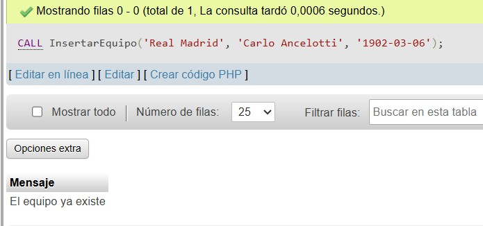


-- Procedimiento 2: Modificar las victorias de un equipo si existe

-- Código del Procedimiento:

```sql
DELIMITER //
CREATE PROCEDURE ModificarVictorias(IN nombre VARCHAR(255), IN victorias INT)
BEGIN
    DECLARE equipoExiste INT;
    
    -- Verificar si el equipo existe
    SELECT COUNT(*) INTO equipoExiste FROM Equipos WHERE Equ_nombre = nombre;
    
    IF equipoExiste > 0 THEN
        -- Actualizar las victorias del equipo
        UPDATE Equipos SET Equ_victorias = victorias WHERE Equ_nombre = nombre;
        
        SELECT 'Victorias actualizadas correctamente' AS Mensaje;
    ELSE
        SELECT 'El equipo no existe' AS Mensaje;
    END IF;
END //

DELIMITER ;
```

__-- Llamadas para probar los procedimientos__
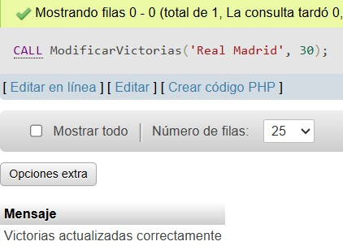


### Creación de procedimientos con la estructura de control alternativa múltiple

-- Procedimiento 3: Actualizar estado de la temporada
-- Este procedimiento actualiza el estado de una temporada según su ID.

-- Código del Procedimiento:

```sql
DELIMITER //
CREATE PROCEDURE ActualizarEstadoTemporada(IN temporadaID INT, IN nuevoEstado VARCHAR(20))
BEGIN
    DECLARE estadoActual BOOLEAN;
    
    -- Obtener el estado actual de la temporada
    SELECT Tem_iniciado INTO estadoActual FROM Temporadas WHERE Tem_id = temporadaID;
    
    CASE
        WHEN estadoActual IS NULL THEN
            SELECT 'La temporada no existe' AS Mensaje;
        WHEN nuevoEstado = 'iniciar' AND estadoActual = FALSE THEN
            UPDATE Temporadas SET Tem_iniciado = TRUE WHERE Tem_id = temporadaID;
            SELECT 'Temporada iniciada correctamente' AS Mensaje;
        WHEN nuevoEstado = 'finalizar' AND estadoActual = TRUE THEN
            UPDATE Temporadas SET Tem_finalizado = TRUE WHERE Tem_id = temporadaID;
            SELECT 'Temporada finalizada correctamente' AS Mensaje;
        ELSE
            SELECT 'No se puede realizar la acción solicitada' AS Mensaje;
    END CASE;
END //
DELIMITER ;
```

__-- Llamadas para probar los procedimientos__
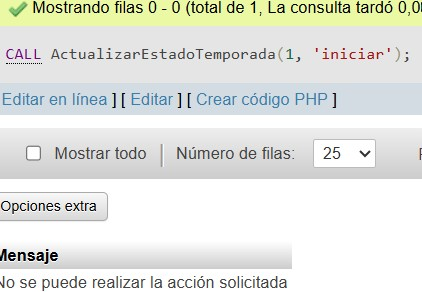

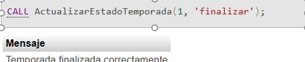

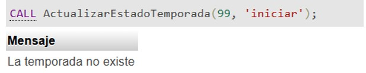


### Creación de procedimientos con la estructura de control CASE de comprobación
 
-- Procedimiento 4: Cambiar el estado de un equipo (activo/inactivo)

-- Código del Procedimiento:

 ```sql
DELIMITER //
CREATE PROCEDURE CambiarEstadoEquipo(IN nombre VARCHAR(255), IN nuevoEstado VARCHAR(10))
BEGIN
    DECLARE equipoExiste INT;
    DECLARE estadoActual VARCHAR(10);

    -- Verificar si el equipo existe
    SELECT COUNT(*), CASE WHEN Equ_victorias >= 10 THEN 'activo' ELSE 'inactivo' END 
    INTO equipoExiste, estadoActual FROM Equipos WHERE Equ_nombre = nombre;

    IF equipoExiste = 0 THEN
        SELECT 'El equipo no existe' AS Mensaje;
    ELSE
        CASE 
            WHEN nuevoEstado = 'activo' AND estadoActual = 'inactivo' THEN
                UPDATE Equipos SET Equ_victorias = 10 WHERE Equ_nombre = nombre;
                SELECT 'El equipo ha sido activado' AS Mensaje;
            WHEN nuevoEstado = 'inactivo' AND estadoActual = 'activo' THEN
                UPDATE Equipos SET Equ_victorias = 0 WHERE Equ_nombre = nombre;
                SELECT 'El equipo ha sido desactivado' AS Mensaje;
            ELSE
                SELECT 'El equipo ya está en el estado solicitado' AS Mensaje;
        END CASE;
    END IF;
END //
DELIMITER ;
```

__-- Llamadas para probar los procedimientos__


-- Procedimiento 5: Eliminar un jugador según su edad

-- Código del Procedimiento:

```sql
DELIMITER //
CREATE PROCEDURE EliminarJugadorPorEdad(IN jugadorID INT)
BEGIN
    DECLARE edadJugador INT;

    -- Obtener la edad del jugador
    SELECT TIMESTAMPDIFF(YEAR, Jug_nacimiento, CURDATE()) INTO edadJugador FROM Jugadores WHERE Jug_id = jugadorID;

    CASE 
        WHEN edadJugador IS NULL THEN
            SELECT 'El jugador no existe' AS Mensaje;
        WHEN edadJugador < 18 THEN
            SELECT 'No se puede eliminar, el jugador es menor de edad' AS Mensaje;
        ELSE
            DELETE FROM Jugadores WHERE Jug_id = jugadorID;
            SELECT 'Jugador eliminado correctamente' AS Mensaje;
    END CASE;
END //
DELIMITER ;
```

__-- Llamadas para probar los procedimientos__
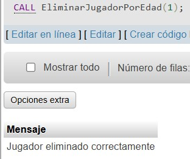
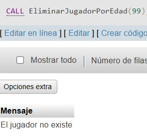


 


### Procedimientos  con manejo de excepciones


### Creación de procedimientos con cursores
 	
-- Procedimiento 6: Listar todos los equipos con sus estadísticas

-- Código del Procedimiento:

```sql
DELIMITER //
CREATE PROCEDURE ListarEquipos()
BEGIN
    DECLARE done INT DEFAULT 0;
    DECLARE id INT;
    DECLARE nombre VARCHAR(255);
    DECLARE victorias INT;
    DECLARE derrotas INT;
    DECLARE total_puntos INT;
    
    DECLARE equipo_cursor CURSOR FOR
    SELECT Equ_id, Equ_nombre, Equ_victorias, Equ_derrotas, Equ_puntos_totales FROM Equipos;
    
    DECLARE CONTINUE HANDLER FOR NOT FOUND SET done = 1;
    
    OPEN equipo_cursor;
    read_loop: LOOP
        FETCH equipo_cursor INTO id, nombre, victorias, derrotas, total_puntos;
        IF done THEN
            LEAVE read_loop;
        END IF;
        
        SELECT id, nombre, victorias, derrotas, total_puntos;
    END LOOP;
    
    CLOSE equipo_cursor;
END //
DELIMITER ;
```

__-- Llamadas para probar los procedimientos__
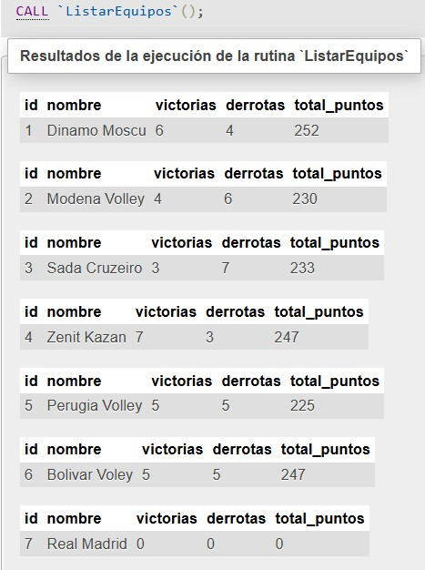


-- Procedimiento 7: Obtener el historial de temporadas y cantidad de equipos por temporada

-- Código del Procedimiento:

```sql
DELIMITER //
CREATE PROCEDURE ListarTemporadas()
BEGIN
    DECLARE done INT DEFAULT 0;
    DECLARE id INT;
    DECLARE nombre VARCHAR(255);
    DECLARE cantidad_equipos INT;
    
    DECLARE temporada_cursor CURSOR FOR
    SELECT Tem_id, Tem_nombre, Tem_cantidad_equipos FROM Temporadas;
    
    DECLARE CONTINUE HANDLER FOR NOT FOUND SET done = 1;
    
    OPEN temporada_cursor;
    read_loop: LOOP
        FETCH temporada_cursor INTO id, nombre, cantidad_equipos;
        IF done THEN
            LEAVE read_loop;
        END IF;
        
        SELECT id, nombre, cantidad_equipos;
    END LOOP;
    
    CLOSE temporada_cursor;
END //
DELIMITER ;
```

__-- Llamadas para probar los procedimientos__
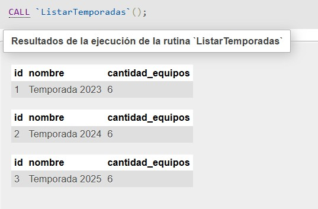


-- Procedimiento 8: Consulta compleja con JOIN - Mostrar los máximos goleadores de cada equipo

-- Código del Procedimiento:

```sql
DELIMITER //
CREATE PROCEDURE MaximosGoleadores()
BEGIN
    DECLARE done INT DEFAULT 0;
    DECLARE equipo_nombre VARCHAR(255);
    DECLARE jugador_nombre VARCHAR(255);
    DECLARE goles INT;
    
    DECLARE cursor_goleadores CURSOR FOR
    SELECT e.Equ_nombre, j.Jug_nombre_completo, j.Jug_dorsal FROM Jugadores j
    JOIN Equipos e ON j.Jug_id_equipo = e.Equ_id
    WHERE j.Jug_dorsal = (SELECT MAX(Jug_dorsal) FROM Jugadores WHERE Jug_id_equipo = e.Equ_id);
    
    DECLARE CONTINUE HANDLER FOR NOT FOUND SET done = 1;
    
    OPEN cursor_goleadores;
    read_loop: LOOP
        FETCH cursor_goleadores INTO equipo_nombre, jugador_nombre, goles;
        IF done THEN
            LEAVE read_loop;
        END IF;
        
        SELECT equipo_nombre, jugador_nombre, goles;
    END LOOP;
    
    CLOSE cursor_goleadores;
END //
DELIMITER ;
```

__-- Llamadas para probar los procedimientos__
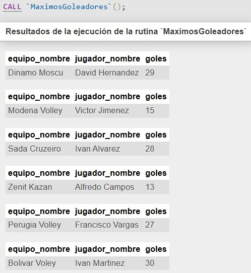


-- Procedimiento 9: Consulta compleja con JOIN - Listar temporadas con sus equipos asociados

-- Código del Procedimiento:

```sql
DELIMITER //
CREATE PROCEDURE TemporadasConEquipos()
BEGIN
    DECLARE done INT DEFAULT 0;
    DECLARE temporada_nombre VARCHAR(255);
    DECLARE equipo_nombre VARCHAR(255);
    
    DECLARE cursor_temporada CURSOR FOR
    SELECT t.Tem_nombre, e.Equ_nombre FROM Temporadas t
    JOIN Equipos e ON t.Tem_id = e.Equ_id;
    
    DECLARE CONTINUE HANDLER FOR NOT FOUND SET done = 1;
    
    OPEN cursor_temporada;
    read_loop: LOOP
        FETCH cursor_temporada INTO temporada_nombre, equipo_nombre;
        IF done THEN
            LEAVE read_loop;
        END IF;
        
        SELECT temporada_nombre, equipo_nombre;
    END LOOP;
    
    CLOSE cursor_temporada;
END //
DELIMITER ;
```

__-- Llamadas para probar los procedimientos__
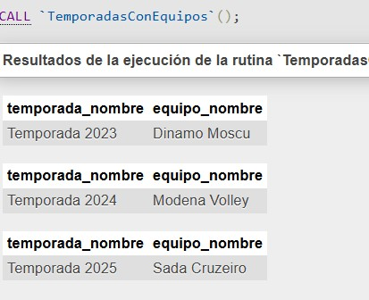


### Creación de funciones con diferentes estructuras de control, cursores y excepciones

-- Funcion 1: 

-- Código de la Funcion:

```sql
DELIMITER //
CREATE FUNCTION PromedioPuntosPorPartido(equipo_id INT) 
RETURNS DECIMAL(10,2)
DETERMINISTIC
BEGIN
    DECLARE puntos_total SMALLINT UNSIGNED;
    DECLARE partidos_total SMALLINT UNSIGNED;
    DECLARE promedio DECIMAL(10,2) DEFAULT 0.00;
    
    -- Manejo de excepciones
    DECLARE CONTINUE HANDLER FOR NOT FOUND RETURN 0.00;
    DECLARE CONTINUE HANDLER FOR 1365 RETURN 0.00; 
    
    SELECT Equ_puntos_totales, Equ_total_partidos 
    INTO puntos_total, partidos_total
    FROM Equipos 
    WHERE Equ_id = equipo_id;
    
    IF partidos_total > 0 THEN
        SET promedio = puntos_total / partidos_total;
    END IF;
    
    RETURN promedio;
END //
DELIMITER ;
```

__-- Llamadas para probar los procedimientos__
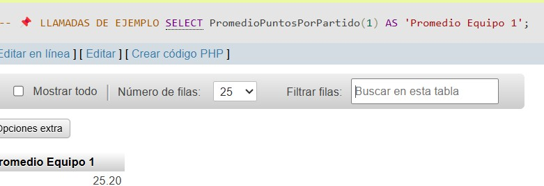


-- Funcion 2: 

-- Código de la Funcion:

```sql
DELIMITER //
CREATE FUNCTION ContarJugadoresPorPosicion(equipo_id INT, posicion VARCHAR(255)) 
RETURNS INT
DETERMINISTIC
BEGIN
    DECLARE contador INT DEFAULT 0;
    DECLARE done INT DEFAULT FALSE;
    DECLARE jugador_posicion VARCHAR(255);
    
    DECLARE cur CURSOR FOR 
        SELECT Jug_posicion 
        FROM Jugadores 
        WHERE Jug_id_equipo = equipo_id;
    
    DECLARE CONTINUE HANDLER FOR NOT FOUND SET done = TRUE;
    
    OPEN cur;
    
    bucle: LOOP
        FETCH cur INTO jugador_posicion;
        IF done THEN
            LEAVE bucle;
        END IF;
        
        IF jugador_posicion = posicion THEN
            SET contador = contador + 1;
        END IF;
    END LOOP;
    
    CLOSE cur;
    
    RETURN contador;
END //
DELIMITER ;
```

__-- Llamadas para probar los procedimientos__
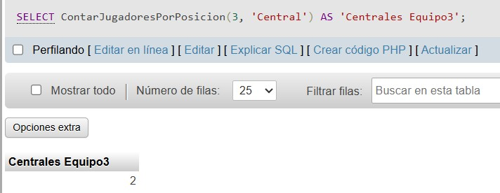


-- Funcion 3: 

-- Código de la Funcion:

```sql
DELIMITER //
CREATE FUNCTION DiferenciaSets(equipo_id INT) 
RETURNS INT
DETERMINISTIC
BEGIN
    DECLARE diferencia INT DEFAULT 0;
    DECLARE sets_loc SMALLINT;
    DECLARE sets_vis SMALLINT;
    DECLARE done INT DEFAULT FALSE;
    DECLARE equipo_es_local BOOLEAN;
    
    DECLARE cur CURSOR FOR 
        SELECT Par_sets_loc, Par_sets_vis, Par_equipo_loc = equipo_id
        FROM Partidos 
        WHERE Par_equipo_loc = equipo_id OR Par_equipo_vis = equipo_id;
    
    DECLARE CONTINUE HANDLER FOR NOT FOUND SET done = TRUE;
    
    OPEN cur;
    
    bucle: LOOP
        FETCH cur INTO sets_loc, sets_vis, equipo_es_local;
        IF done THEN
            LEAVE bucle;
        END IF;
        
        IF equipo_es_local THEN
            SET diferencia = diferencia + (sets_loc - sets_vis);
        ELSE
            SET diferencia = diferencia + (sets_vis - sets_loc);
        END IF;
    END LOOP;
    
    CLOSE cur;
    
    RETURN diferencia;
END //
DELIMITER ;
```

__-- Llamadas para probar los procedimientos__
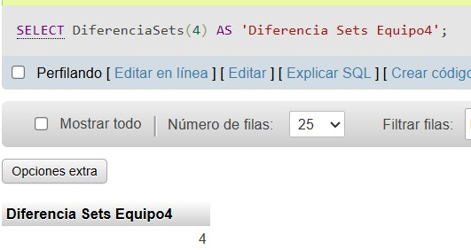


## Creacion de vistas


__Vista para obtener un resumen de todas las temporadas__
CREATE VIEW Vista_Temporadas AS
SELECT Tem_id, Tem_nombre, Tem_cantidad_jornadas, Tem_cantidad_equipos, 
       CASE 
           WHEN Tem_finalizado = TRUE THEN 'Finalizada'
           WHEN Tem_iniciado = TRUE THEN 'En Curso'
           ELSE 'Pendiente'
       END AS Estado
FROM Temporadas;

__-- Llamadas para probar los procedimientos__
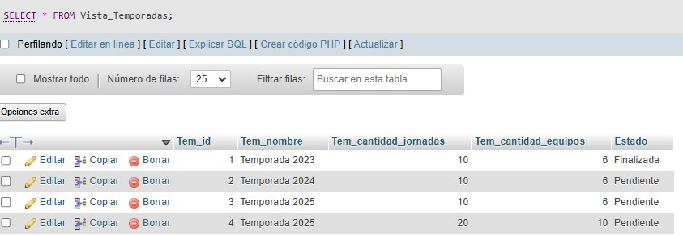

__Vista para obtener las jornadas con el estado y su temporada asociada__
CREATE VIEW Vista_Jornadas AS
SELECT J.Jor_id, J.Jor_jugado, T.Tem_nombre AS Temporada
FROM Jornadas J
JOIN Temporadas T ON J.Jor_id_temporada = T.Tem_id;

__-- Llamadas para probar los procedimientos__
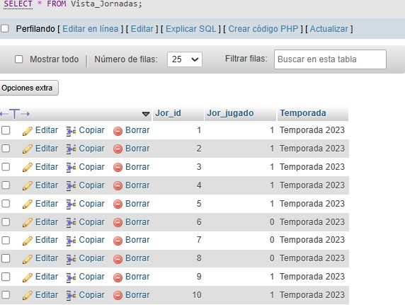

__Vista para obtener los registros de cambios__
CREATE VIEW Vista_Logs AS
SELECT Log_id, Log_fecha, Log_accion, Log_detalle
FROM Logs
ORDER BY Log_fecha DESC;

__-- Llamadas para probar los procedimientos__
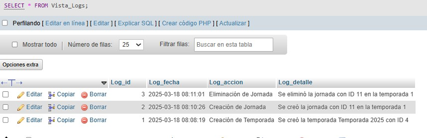


## Creacion de Triggers


__Crear tabla de logs para registrar cambios__
CREATE TABLE Logs (
    Log_id INT PRIMARY KEY AUTO_INCREMENT,
    Log_fecha TIMESTAMP DEFAULT CURRENT_TIMESTAMP,
    Log_accion VARCHAR(50),
    Log_detalle TEXT
);

__Trigger para registrar la creación de una temporada__
CREATE TRIGGER after_insert_temporada
AFTER INSERT ON Temporadas
FOR EACH ROW
INSERT INTO Logs (Log_accion, Log_detalle)
VALUES ('Creación de Temporada', CONCAT('Se creó la temporada ', NEW.Tem_nombre, ' con ID ', NEW.Tem_id));

__-- Llamadas para probar los procedimientos__


__Trigger para registrar cambios en una temporada__
CREATE TRIGGER after_update_temporada
AFTER UPDATE ON Temporadas
FOR EACH ROW
INSERT INTO Logs (Log_accion, Log_detalle)
VALUES ('Modificación de Temporada', CONCAT('Se modificó la temporada ', OLD.Tem_nombre, ' con ID ', OLD.Tem_id));

__Trigger para registrar eliminación de una temporada__
CREATE TRIGGER after_delete_temporada
AFTER DELETE ON Temporadas
FOR EACH ROW
INSERT INTO Logs (Log_accion, Log_detalle)
VALUES ('Eliminación de Temporada', CONCAT('Se eliminó la temporada ', OLD.Tem_nombre, ' con ID ', OLD.Tem_id));

__Trigger para registrar la creación de una jornada__
CREATE TRIGGER after_insert_jornada
AFTER INSERT ON Jornadas
FOR EACH ROW
INSERT INTO Logs (Log_accion, Log_detalle)
VALUES ('Creación de Jornada', CONCAT('Se creó la jornada con ID ', NEW.Jor_id, ' en la temporada ', NEW.Jor_id_temporada));

__-- Llamadas para probar los procedimientos__


__Trigger para registrar cambios en una jornada__
CREATE TRIGGER after_update_jornada
AFTER UPDATE ON Jornadas
FOR EACH ROW
INSERT INTO Logs (Log_accion, Log_detalle)
VALUES ('Modificación de Jornada', CONCAT('Se modificó la jornada con ID ', OLD.Jor_id, ' en la temporada ', OLD.Jor_id_temporada));

__Trigger para registrar eliminación de una jornada__
CREATE TRIGGER after_delete_jornada
AFTER DELETE ON Jornadas
FOR EACH ROW
INSERT INTO Logs (Log_accion, Log_detalle)
VALUES ('Eliminación de Jornada', CONCAT('Se eliminó la jornada con ID ', OLD.Jor_id, ' en la temporada ', OLD.Jor_id_temporada));
