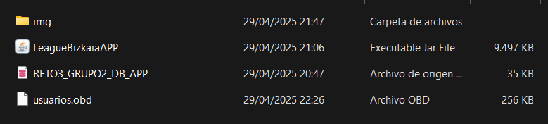
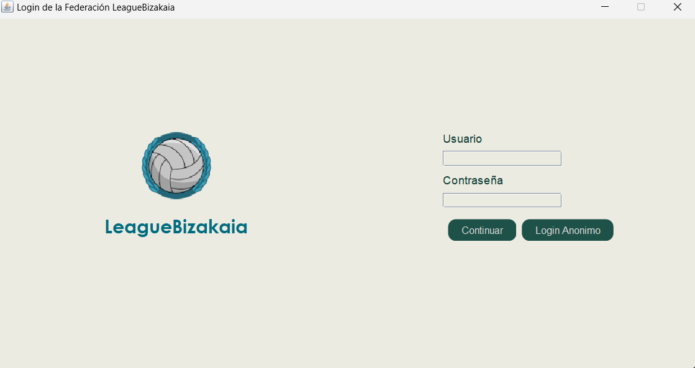
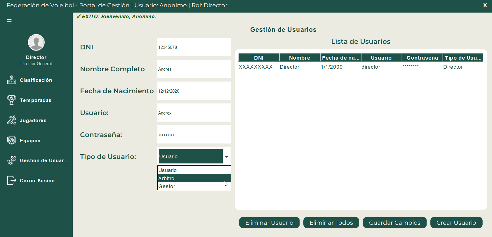
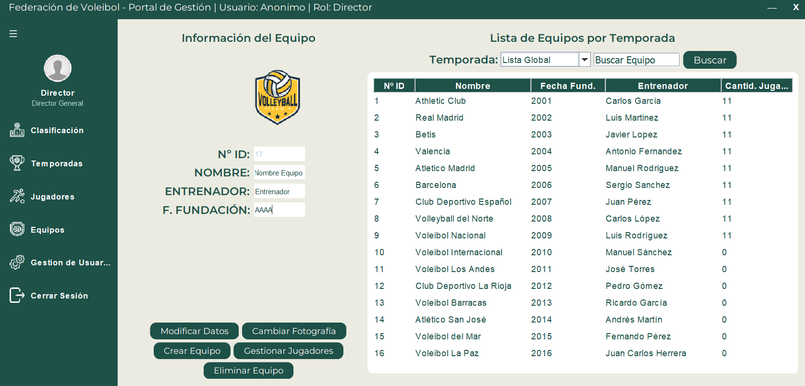
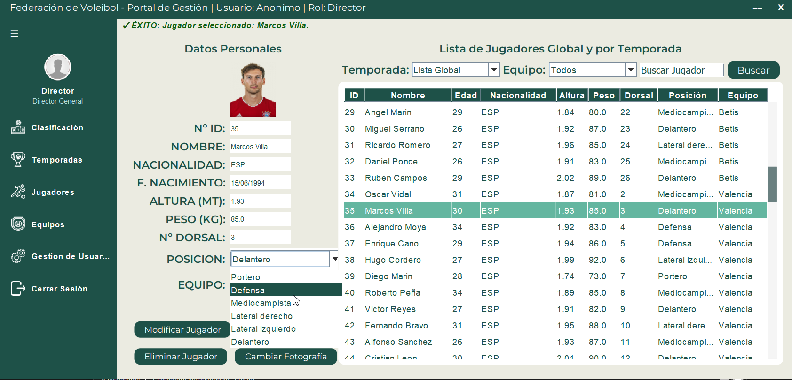
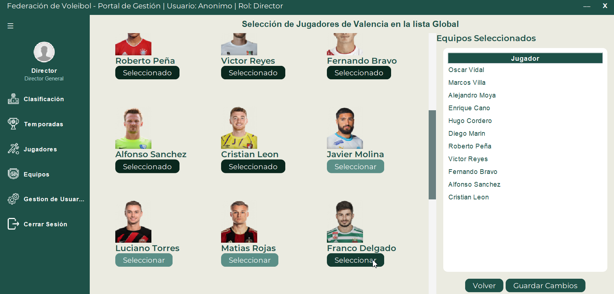
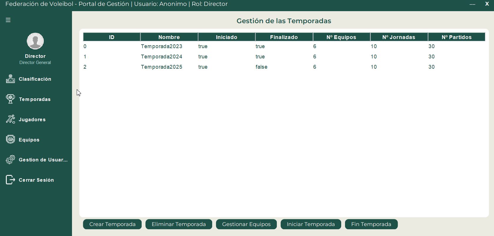
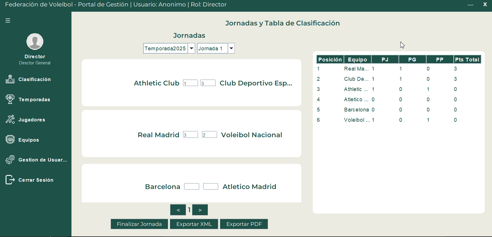

# **LeagueBizkaiaAPP**
 
## **Introducción**

**LeagueBizkaiaAPP** es una aplicación de escritorio diseñada para la gestión integral de una liga de fútbol. Esta herramienta permite llevar un control detallado de todos los aspectos relacionados con la liga, desde la inscripción de equipos y jugadores, hasta la creación de temporadas y la gestión de los partidos. Además, ofrece funcionalidades para generar automáticamente las jornadas de un torneo, registrar resultados, y modificar la clasificación, todo de manera intuitiva y eficiente. La aplicación también cuenta con la opción de exportar los datos necesarios para su integración con el sitio web de la liga.

## **Características Principales**

1. **Gestión de Equipos y Jugadores**: Permite registrar los equipos que participan en la liga y fichar jugadores a dichos equipos.
   
2. **Creación de Temporadas**: Puedes crear nuevas temporadas y asignar equipos a las mismas. Esto incluye la generación automática de los enfrentamientos de las jornadas del torneo.

3. **Generación Automática de Jornadas**: La aplicación genera automáticamente el calendario de partidos de la temporada con los equipos enfrentándose entre sí. Además, permite ingresar y modificar los resultados de los encuentros.

4. **Tabla de Clasificación**: Visualiza en tiempo real la clasificación de los equipos según los resultados de los partidos disputados.

5. **Exportación de Datos**: La aplicación permite exportar los datos generados (equipos, jugadores, partidos, resultados y clasificación) en un formato adecuado para ser utilizado en el sitio web de la liga.

---

## **Instalación**

Para instalar **LeagueBizkaiaAPP** en tu computadora, sigue estos pasos:

### Requisitos Previos

- **Java Runtime Environment (JRE)**: Asegúrate de tener instalada una versión compatible de Java en tu sistema. Puedes descargarla desde el sitio oficial de Oracle [aquí](https://www.oracle.com/java/technologies/javase-jre8-downloads.html).
  
- **XAMPP**: Para poder gestionar la base de datos localmente, necesitas tener **XAMPP** instalado en tu equipo. Puedes descargarlo e instalarlo desde [aquí](https://www.apachefriends.org/es/index.html).

---

### Pasos de Instalación

1. **Descarga del Software**:
   - Descarga el archivo comprimido **LeagueBizkaiaAPP** desde el siguiente enlace:

[!file Descargar LeagueBizkaiaAPP](./ficheros/Grupo2_LeagueBizkaiaAPP.zip)

2. **Instalación**:
   - Extrae el contenido del archivo ZIP descargado en una carpeta de tu preferencia.
   - Dentro de la carpeta extraída, encontrarás el fichero `RETO3_GRUPO2_DB_APP.sql`. Este archivo contiene la base de datos de la aplicación. Es fundamental que lo importes a tu servidor local de base de datos.
     - dentro de **PhpMyAdmin** crear la base de datos `reto3` y pegar el contenido del fichero `RETO3_GRUPO2_DB_APP.sql` en la consulta y Continuar.

3. **Verificación**:
   - Una vez que la base de datos haya sido importada correctamente, navega a la carpeta donde extrajiste los archivos de la aplicación.
   - Asegúrate de que la carpeta **img** y el archivo `usuarios.odb` se encuentren en la misma ubicación que el archivo **LeagueBizkaiaAPP.jar**. La carpeta **img** es esencial para el almacenamiento de las imágenes asociadas a los equipos y jugadores, mientras que **usuarios.obd** contiene las credenciales necesarias para acceder al sistema.
   - Ejecuta el archivo **LeagueBizkaiaAPP.jar**.
   - Si todo está bien configurado, verás el panel de inicio de sesión de la aplicación, donde podrás ingresar tus credenciales y comenzar a usar la app.

---

### **Credenciales**:

  - **Usuario**: `director`
  - **Contraseña**: `director`
  
  **¡IMPORTANTE!**: Este usuario es el **SuperAdmin** de la aplicación. Con estas credenciales podrás acceder al sistema y gestionar la creación de nuevos usuarios dentro de la plataforma.

- El archivo **usuarios.obd** debe estar ubicado en la misma carpeta que el archivo **LeagueBizkaiaAPP.jar**.
- Asegúrate de que este archivo esté presente y correctamente configurado. Si no tienes credenciales adicionales, puedes crear nuevos usuarios desde la sección de administración una vez que hayas iniciado sesión como **SuperAdmin**.

Si las credenciales no son válidas o el archivo **usuarios.obd** falta, no podrás acceder a la aplicación correctamente.

---

## **1. Gestión de Usuarios**

En el **Panel de Usuarios**, los administradores pueden gestionar los usuarios registrados en el sistema. Las acciones disponibles son:

### **Acciones Disponibles:**
- **Crear Usuario**: Permite agregar un nuevo usuario a la aplicación.
- **Eliminar Usuario**: Permite eliminar un usuario existente. **Nota**: El usuario **Director** no podrá ser eliminado.
- **Modificar Usuario**: Permite actualizar los datos y los privilegios de un usuario.

### **Detalles al Crear un Usuario:**

Cuando se crea un nuevo usuario, se deben ingresar los siguientes campos:

- **DNI**: El DNI debe consistir en 8 números seguidos de una letra (por ejemplo, `12345678A`).
- **Fecha de Nacimiento**: La fecha debe ser ingresada en formato **dd/mm/aaaa** (por ejemplo, `12/12/2000`).
- **Contraseña**: La contraseña debe tener exactamente 8 caracteres alfanuméricos. Es recomendable que sea una combinación de letras y números para mayor seguridad.
- **Tipo de Usuario**: Se debe seleccionar el tipo de usuario, que puede ser:
  - **Usuario**
  - **Árbitro**
  - **Gestor**

### **Modificación de Usuarios:**
Una vez que un usuario ha sido creado, puedes modificar los siguientes detalles:
- **Datos Personales**: Se pueden modificar los datos como nombre, DNI, fecha de nacimiento, etc.
- **Privilegios (Tipo de Usuario)**: Se puede cambiar el **Tipo de Usuario**, lo que afecta a los privilegios del usuario dentro de la aplicación. Por ejemplo, un **Gestor** puede tener más permisos que un **Usuario**.

### **Restricciones Importantes:**
- **El Director no puede ser eliminado**: El usuario **Director** es el SuperAdmin y tiene privilegios especiales. Por lo tanto, no puede ser eliminado desde el panel.
  
--- 

## **2. Gestión de Equipos**

   En este panel, puedes:

- **Crear equipos** y asignarles jugadores.
- **Modificar la información** del equipo (nombre, entrenador, fecha de fundación).
- **Cambiar el escudo** del equipo.
- **Eliminar un equipo**, siempre que no haya participado en una temporada previa.
- **Asignar jugadores a un equipo** podremos ver una lista de jugadores con fichaje libre y los propios del equipo para asignarlos.
- **Busqueda por nombre** tenemos un buscador a la mano por si quieres encontrar rapido a un equipo.

---

## **3. Gestión de Jugadores**

En este panel, puedes:

- **Crear Jugador**:
    - Se deben ingresar los siguientes datos:
    - **Nombre**: Nombre completo del jugador.
    - **Nacionalidad**: Nacionalidad del jugador.
    - **Fecha de Nacimiento**: En formato **dd/mm/aaaa**.
    - **Altura**: En metros.
    - **Peso**: En kilogramos.
    - **Número de Dorsal**: El número que usará el jugador.
    - **Posición**: Selecciona la posición del jugador (Delantero, Defensa, Mediocampista, etc.).
    - **Equipo**: Selecciona el equipo al que el jugador pertenecerá.
  
  _.
- **Modificar Jugador**:
  - Puedes editar los datos del jugador, como nombre, fecha de nacimiento, altura, peso, etc.
  - **Cambiar fotografía**: Puedes actualizar la foto del jugador.

- **Eliminar Jugador**:
  - Solo puedes eliminar a un jugador **si no ha participado en una temporada previa**.

- **Búsqueda**:
  - **Buscar por nombre**: Filtra jugadores que coincidan con el nombre ingresado.
  - **Filtrar por temporada y equipo**: Puedes ver los jugadores filtrados por temporada o equipo.

---

## **4. Fichar Jugador a Equipo**

Para fichar jugadores, sigue estos pasos:

1. **Accede al Panel de Equipos** y selecciona un **equipo** ya creado.
2. Haz clic en **Gestionar Jugadores**. Esto te llevará a una sección donde podrás ver:
   - Los jugadores **actualmente fichados** por el equipo.
   - Una **lista de jugadores disponibles** para fichar.
3. Para fichar un jugador, simplemente **selecciona** al jugador de la lista de disponibles y haz clic en **Guardar Cambios**.
4. Para **retirar un jugador** del equipo, deselecciona al jugador y guarda los cambios.

---
Aquí tienes la descripción mejorada y concisa del **Panel de Temporadas**:

---

## **5. Panel de Temporadas**

En este panel, podrás gestionar las temporadas de la liga. Las opciones disponibles son:

### **Acciones Disponibles:**

- **Crear Temporada**:
  - Al presionar este botón, serás redirigido a una sección similar al de Seleccion de Jugadores donde podrás **asignar equipos** a la nueva temporada. Es importante que cada equipo cuente con **al menos 11 jugadores** para poder participar en la temporada.
  
- **Eliminar Temporada**:
  - Solo se puede eliminar una temporada si **no ha sido iniciada** o ya **ha finalizado**.

- **Gestionar Equipos**:
  - Puedes **asignar equipos** a una temporada que aún **no haya comenzado**. Esto te llevará al panel donde podrás seleccionar los equipos para esa temporada.

- **Iniciar Temporada**:
  - Para iniciar la temporada, debes tener equipos **asignados** y **una cantidad de equipos par**. Al iniciar, se generarán automáticamente las **jornadas** y los **enfrentamientos** de la temporada.

- **Finalizar Temporada**:
  - Para finalizar la temporada, **todos los resultados de los partidos** deben estar ingresados. Una vez finalizada, la temporada ya no podrá modificarse.

---

Aquí tienes una descripción clara y concisa para la sección de **Introducción de Resultados de los Partidos**:

---

## **6. Introducción de Resultados de Partidos**

Para ingresar los resultados de los partidos de una temporada:

1. **Accede al Panel de Clasificación**:
   - En este panel podrás ver los enfrentamientos organizados por **temporada**, **jornada** y **partidos**.

2. **Ingreso de Resultados**:
   - En cada enfrentamiento, ingresa el resultado final del partido (puntos obtenidos por cada equipo).
   - Al terminar de ingresar los resultados, presiona el botón **"Finalizar Jornada"** para guardar los puntos y actualizar la **tabla de clasificación**.

3. **Actualización de la Tabla**:
   - La **tabla de clasificación** se actualizará automáticamente cada vez que ingreses los resultados de los partidos de una jornada.

4. **Exportar la Tabla de Clasificación**:
   - Puedes descargar la **tabla de clasificación** de la temporada en formato **PDF** para tener una copia oficial.

5. **Exportar Datos de la Temporada**:
   - Al finalizar una temporada, puedes exportar los **datos** (resultados, equipos, clasificaciones) de la temporada en curso o ya finalizada, en formato **XML**, para su uso en el sitio web oficial de la liga.

